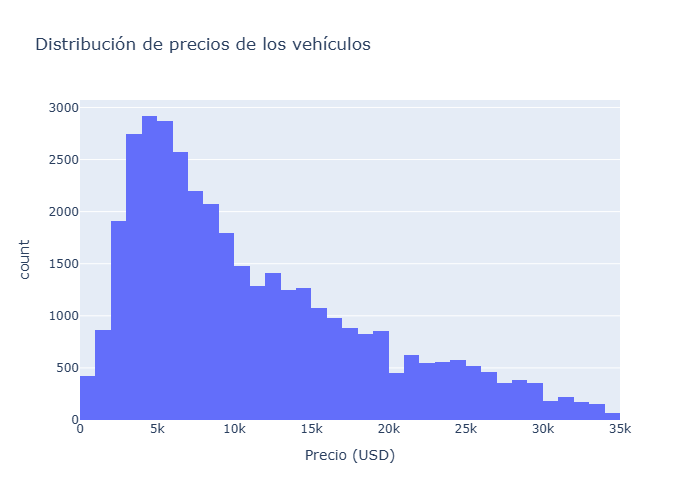
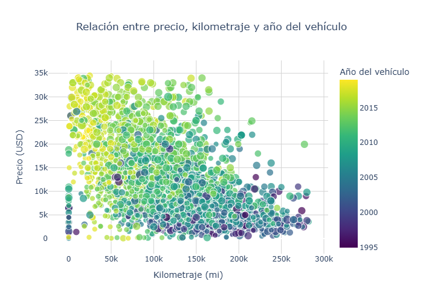

# 🚗 Vehicle Market Analysis Dashboard


## 📌 Descripción del Proyecto
Este proyecto es una aplicación web interactiva hecha con **Streamlit** para analizar datos del mercado de vehículos en Estados Unidos.  
Permite explorar, visualizar y hacer predicciones de precios usando diferentes filtros y gráficos de manera sencilla.

**Enlace a la pagína web** 👉 https://vehicles-app-9tty.onrender.com

## 📊 Hallazgos Clave (Visualizaciones)
Durante la limpieza de datos, se aplicaron técnicas estadísticas (Rango Intercuartílico - IQR) para filtrar valores atípicos (como autos de $375,000 USD o edades negativas), logrando un dataset representativo del mercado real.

### 1. Distribución de Precios
*Aquí podemos observar dónde se concentra el mercado real después de limpiar el ruido estadístico.*


### 2. Precio vs. Kilometraje
*Análisis de correlación: cómo la depreciación impacta el valor del vehículo según su uso.*


---

## 📂 Estructura del Proyecto
.
├── assets/             # Logos e imágenes de la app
├── data/               # Datasets (.csv) crudos y limpios
├── notebooks/          # Análisis Exploratorio (EDA.ipynb)
├── src/                # Scripts de Python adicionales
├── requirements.txt    # Librerías necesarias
└── README.md           # Este archivo

- **src/app.py** → Archivo principal de la aplicación en Streamlit.  
- **data/vehicles_us.csv** → Conjunto de datos usado para el análisis.  
- **notebooks/notebooks/EDA.ipynb** → Análisis exploratorio inicial de los datos.  
- **requirements.txt** → Librerías necesarias para ejecutar el proyecto.  
- **README.md** → Este archivo.

---

## 🚀 Cómo ejecutar la aplicación

1. Clona el repositorio o descarga los archivos:
   ```bash
   git clone https://github.com/inbemero-tech/vehicles-analysis.git

2. Crea y activa un entorno virtual:
   ```bash
   python -m venv .venv
   # En Windows:
   .venv\Scripts\activate
   # En Mac/Linux:
   source .venv/bin/activate

3. Instala las dependencias necesarias:
   ```bash
   pip install -r requirements.txt

4. Ejecuta la aplicación en tu navegador:
    ```bash
    streamlit run app.py


La aplicación se abrirá automáticamente en tu navegador en la dirección:
👉 http://localhost:8501

## 📊 Qué puedes hacer en la app

La aplicación permite analizar el mercado de vehículos de manera visual e interactiva.
Entre sus funciones principales se incluyen:

### 🔍 Filtros interactivos

Filtra los vehículos por:

* Tipo
* Condición
* Rango de años
* Rango de precios

### 📈 Visualizaciones disponibles

* Histograma: muestra la distribución de precios.
* Gráfico de dispersión: relaciona año y kilometraje con el precio.
* Gráfico de barras: compara el precio promedio por tipo de vehículo.
* Mapa de calor: muestra correlaciones entre variables numéricas.
* Cada visualización incluye una breve explicación para entender mejor lo que muestran los datos.

### 📋 Tabla de datos

Visualiza todo el conjunto de datos original con desplazamiento horizontal y vertical.

### 🤖 Modelo predictivo

Entrena un modelo de regresión lineal simple que estima el precio del vehículo según sus características.

### 💡 Simulador de precio

Permite al usuario ingresar los datos de un vehículo (año, kilometraje, tipo, etc.) y obtener un precio estimado en tiempo real.

### 🧠 Tecnologías utilizadas

Python
Streamlit
Pandas
Seaborn / Matplotlib
Scikit-learn

### 📘 Notas finales

Este proyecto fue desarrollado con el objetivo de practicar análisis de datos y visualización interactiva.
La idea es facilitar la exploración del mercado de vehículos de una forma intuitiva y visual.

💬 Desarrollado por Inti — Exploración y análisis del mercado automotriz 🚗📊
